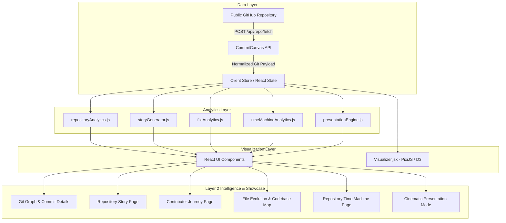

# CommitCanvas — Visualize How Code Evolves

**CommitCanvas** transforms public GitHub repository histories into interactive, living visual intelligence platforms. While GitHub shows what a codebase looks like today, CommitCanvas explains **how it evolved** over time through animated commit graphs, chronological repository stories, contributor journeys, file evolution heatmaps, time travel snapshots, and automated cinematic presentations.

---

## 🌟 Product Vision

> **GitHub manages repositories. CommitCanvas explains how they evolved.**

Instead of scrolling through flat commit logs or diff lists, CommitCanvas reconstructs the recorded evolution of a repository using high-performance 2D canvas visualization and pure analytical engines.

---

## ✨ Features

- **Animated Git Graph**: Multi-branch commit visualizer built on PixiJS and D3 layout algorithms. Features smooth zooming, panning, node highlighting, merge detection, and glowing active states.
- **Repository Story**: Chronological narrative breakdown of key project milestones (Project Begins, Development Accelerates, Major Merges, Large Change Sets, and Current State).
- **Contributor Intelligence**: In-depth contributor breakdown displaying commit distribution shares, active time spans, sparklines, and individual developer journeys.
- **File Evolution & Codebase Map**: Hierarchical folder explorer, directory activity heatmaps (High/Medium/Low tiers), file-touch frequency, and file evolution detail timelines.
- **Engineering Insights**: Factual, evidence-based repository observations (Most Touched File, Peak Recorded Activity, Most Active Directory, Largest Change Set).
- **Repository Time Machine**: Travel backward and forward through time to reconstruct exact repository snapshots (commits, contributors, observed files, directories, merges) at any historical timestamp. Supports `COMMIT` snap mode and `CONTINUOUS` dragging.
- **Cinematic Presentation Mode**: Full-screen, automated 60–90 second showcase walkthrough designed for recruiters and technical presentations. Features scene auto-advancement, pause/resume, keyboard navigation (`Left`, `Right`, `Space`, `Esc`), and accessibility controls.
- **Dual Theme System**: Independent Dashboard Themes (Electric Blue, Cyber Purple, Emerald, Solar Gold, Crimson) and Graph Themes for full aesthetic customization.

---

## 🏗 System Architecture



---

## 🛠 Tech Stack

- **Core**: React 18, JavaScript (ES6+), HTML5, Vanilla CSS / TailwindCSS
- **Build Tool**: Vite v4
- **Graphics & Layout**: PixiJS v7, D3-shape, D3-hierarchy, D3-scale
- **State & Animation**: Zustand, Framer Motion
- **HTTP Client**: Axios
- **Routing**: React Router v6

---

## 🚀 Getting Started

### Prerequisites
- **Node.js**: v18.0.0 or higher
- **npm**: v9.0.0 or higher

### Installation

1. **Clone the repository**:
   ```bash
   git clone https://github.com/Nithinbr2005/commit-canvas-project.git
   cd commit-canvas-project/frontend
   ```

2. **Install frontend dependencies**:
   ```bash
   npm install
   ```

3. **Run the local development server**:
   ```bash
   npm run dev
   ```
   Open your browser at `http://localhost:5173`.

---

## 📦 Production Build

To test and build the production bundle:

```bash
npm run build
```

The optimized static production output will be generated in `frontend/dist/`.

---

## 🛡 Data Accuracy & Engineering Philosophy

- **Factual Terminology**: CommitCanvas displays facts calculated strictly from analyzed commit history. Labels use factual terms such as *Observed Files*, *Analyzed History*, *Recorded Touches*, and *Contributor with Most Touches*.
- **State Preservation**: Exploring different tabs, switching themes, or entering/exiting Presentation Mode never corrupts the loaded repository state or triggers redundant API refetches.
- **Performance Optimized**: Heavy analytical calculations are memoized and pre-computed once per repository load.

---

## 📄 License

MIT License. Designed and developed for CommitCanvas.
